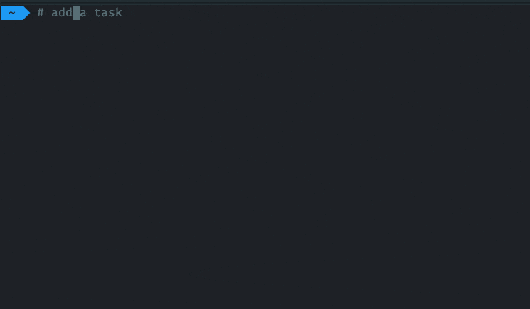

# Tod

[](https://github.com/alanvardy/tod) [](https://codecov.io/gh/alanvardy/tod) [](https://crates.io/crates/tod)

A tiny todoist CLI program. Takes simple input and dumps it in your inbox or another project. Takes advantage of natural language processing to assign due dates, tags, etc.



Will ask for your [Todoist API token](https://todoist.com/prefs/integrations) on the first run, and your data in JSON format in `$XDG_CONFIG_HOME/tod.cfg`. This defaults to:

- `~/.config/tod.cfg` on Linux
- `~/Library/Application Support/tod.cfg` on Mac
- No idea about Windows, sorry!

## Install from Crates.io

[Install Rust](https://www.rust-lang.org/tools/install)

```bash
# Linux and MacOS
curl --proto '=https' --tlsv1.2 -sSf https://sh.rustup.rs | sh
```

Install Tod

```bash
cargo install tod
```

## Install from AUR

```bash
# Use yay or another AUR helper
yay tod-bin
```

## Install from GitHub

[Install Rust](https://www.rust-lang.org/tools/install)

Clone the project

```bash
git clone git@github.com:alanvardy/tod.git
cd tod
./test.sh # run the tests
cargo build --release
```

You can then find the binary in `/target/release/`

## Usage

Start with the help flag to get the latest commands

```bash
> tod -h

A tiny unofficial Todoist client

Usage: tod [OPTIONS]

Options:
  -t, --task <new task>...
          Create a new task with text. Can specify project option, defaults to inbox.
  -p, --project <PROJECT NAME>
          The project namespace, for filtering other commands, use by itself to list all tasks for the project
  -n, --next
          Get the next task by priority. Requires project option.
  -x, --nextinteractive
          Fetches tasks one at a time by priority, and completes with an interactive prompt. Requires project option.
  -c, --complete
          Complete the last task fetched with next
  -l, --list
          List all projects in the local config.
  -a, --add <PROJECT NAME> <PROJECT ID>
          Add a project to config with id
  -r, --remove <PROJECT NAME>
          Remove a project from config by name
  -s, --sort
          Sort inbox by moving tasks into projects
  -z, --prioritize
          Assign priorities to tasks. Can specify project option, defaults to inbox.
  -d, --date tasks
          Assign dates to tasks without dates. Can specify project option, defaults to inbox.
  -e, --scheduled
          Returns items that are today and have a time. Can specify project option, defaults to inbox.
  -o, --config <CONFIGURATION PATH>
          Absolute path of configuration. Defaults to $XDG_CONFIG_HOME/tod.cfg
  -h, --help
          Print help
  -V, --version
          Print version
```

- Add your most commonly used projects, the project ID is the last series of numbers in the URL. If the project name includes spaces, wrap the project name with quotes.
- You can use natural language processing such as dates priority etc when sending to inbox, but not to the projects due to current limitations.
- Items are ranked by points and the first is returned:
  - Item is overdue: 150
  - The date is today with no time: 100
  - The date is today with time in next or last 15 min: 200
  - No date: 80
  - Not recurring: 50
  - Item has no priority: 2
  - Priority 1: 1
  - Priority 2: 3
  - Priority 3: 4

### Examples

```bash
# Create a new task in inbox using natural language processing
tod -t Buy milk from the grocery store tomorrow p1

# Create a task in a project
tod -p myproject -t write more rust \\ with a description

# Get the next task for a project
tod -np myproject

# Go through tasks with an interactive prompt, completing them in order of importance one at a time.
tod -xp myproject

# Complete the last "next task" and get another
tod -c && tod -np myproject

# Get your work schedule
tod -ep work

# Get all tasks for work
tod -p work
```

## Disabling spinners

Find the line in your `tod.cfg` that reads `"spinners": null` and change the value to false.

## Why I made this

I am a developer who uses Todoist to reduce stress and cognitive overhead, by delegating things that a machine does well to a machine. This CLI application scratches some very specific itches for me, and I hope that it may be of use to others as well!

Some points around my general strategy:

- Do one thing at a time, multi-tasking is an illusion (see `--next`)
- Capture all tasks immediately with the inbox and add detail later (see `--task`)
- Use prioritize and sort to batch process the inbox infrequently (see `--prioritize` and `--sort`)
- Make all your tasks "actions", concrete tasks that can be acted on. Add phone numbers, hyperlinks etc to your tasks
- Batch process like things as infrequently as possible to lower context switching, i.e. clear your email inbox once per day, spam once per week.
- Remember that the objective is to **get the important things done with less friction**, not just get more things done.
- Further to the above point, make sure to leave yourself margin. It is in the spaces between the periouds work that we recover and get our best ideas.
- Less projects are better than more projects
- Use projects as "modes" where you only work in one at a time
- Don't put a date on it unless it needs to be done that day
- Don't put a time on it unless it is an appointment with yourself or others

## Related projects

- [Alfred Workflow](https://github.com/stacksjb/AlfredTodWorkflow)
