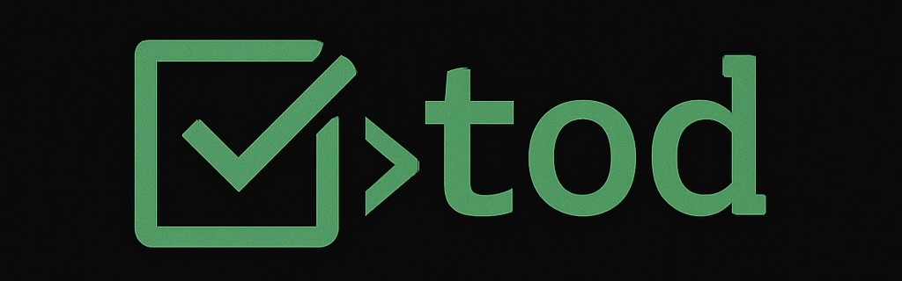

# 

[](https://github.com/alanvardy/tod) [](https://codecov.io/gh/alanvardy/tod) [](https://crates.io/crates/tod) [](https://github.com/alanvardy/tod/actions/workflows/dependabot/dependabot-updates)

[](https://github.com/alanvardy/tod/actions/workflows/release_linux.yml)
[](https://github.com/alanvardy/tod/actions/workflows/release_macos.yml)
[](https://github.com/alanvardy/tod/actions/workflows/release_windows.yml)
[](https://github.com/alanvardy/homebrew-tod/actions/workflows/update_formula.yml)

An unofficial Todoist command-line client. Takes simple input and dumps it in your inbox or another project. Takes advantage of natural language processing to assign due dates, tags, etc. Designed for single-tasking in a world filled with distraction.

Get started with [Homebrew](https://brew.sh) (macOS, Linux, WSL)

```bash
brew tap alanvardy/tod
brew install tod
```

or [Scoop](https://scoop.sh/) (Windows)

```powershell
scoop bucket add tod https://github.com/alanvardy/tod
scoop install tod
```

or [Cargo](https://crates.io/crates/tod) (Rust Package Manager / All Platforms)

```bash
cargo install tod
```

- [Installation](/docs/installation.md)
- [Usage](/docs/usage.md)
- [Configuration](/docs/configuration.md)
- [Motivation](/docs/motivation.md)
- [Contributing](/docs/contributing.md)

## Related projects

- [Alfred Tod Workflow](https://github.com/stacksjb/AlfredTodWorkflow)

## Other projects by Alan Vardy

- [lnr - Linear CLI client](https://github.com/alanvardy/lnr)
- [gpto - OpenAI CLI client](https://github.com/alanvardy/gpto)
- SingleTask - A webapp for completing Todoist tasks one at a time
  - [GitHub](https://github.com/alanvardy/singletask)
  - [WebApp](https://singletask-6hm5.shuttle.app)
